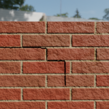
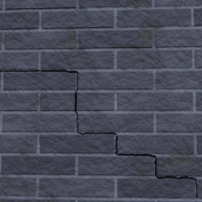
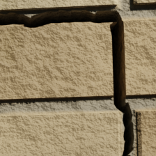

# Cracked surface dataset generation framework

A dataset generation framework for generating images and labels of cracked masonry structures for crack segmentation of masonry structures.
Using a novel crack generation algorithm and Blender as a rendering engine, cracks are generated from a 2D surface and embedded in 3D in Blender.
The datasets generated using this method are originall tested using the [networks from Dais et al.](https://github.com/DavidHidde/CNN-masonry-crack-tasks).





## Usage

The main crack generation can be tested through the playground scripts [`crack_path_generation_playground.py`](src/crack_path_generation_playground.py) [`crack_model_generation_playground.py`](src/crack_model_generation_playground.py), which allow for testing the path generation and model generation by tweaking some parameters in a UI. The paramters that aren't exposed (like trajectory generation and the surface) can be found in the [`default_parameters.py`](src/util/default_parameters.py) and the serialized `Surface` file `surface.dump`. Note that a new surface dump can be created by setting `DUMP_SURFACE` in [`generate_dataset.py`](src/generate_dataset.py).  

For testing the dataset generation, you can simply run [`blender_start_render_script.py`](src/blender_start_render_script.py) from within Blender to run the script for 1 image and with the default [`configuration.yaml`](src/resources/configuration.yaml). To run the script in the background for a set dataset size and using a set configuration, you can run it from a terminal:

```bash
blender resources/scene.blend -b -P blender_start_render_script.py -- --cycles-device <device> -c <dataset_size> -p <configuration yaml file path>
```

where the `<device>` is one of `[CPU, CUDA, OPTIX, HIP, ONEAPI, METAL]`, argument `-c` is used to set the desired dataset size and `-p` is the path to the configuration file that should be used.

### The `scene.blend` features

The Blender source file contains a couple of features that the framework is designed around. The most important of these are:

* The framework expects both an object for a wall and its mortar. These can be generated through the Geometry Nodes modifier `Wall v3` which can be applied to any cube-like geometry. Be sure to always apply the object scale when using this modifier.
* Wall models are expected to have a boolean modifier called `crack_difference`.
* The world texture ends in a mix node, which is used to turn the HDRI on and off.

The framework also contains materials for the walls. These materials use the brick texture from Blender, which is lined up to work with the current dimensions used for bricks (0.21 x 0.05 with a mortar size of 0.1). The default settings for the `Wall v3` geometry nodes modifier do line up correctly with the material, but changing the dimension settings in the nodes modifier will cause the material to not line up correctly anymore. This also happens when using a different width : height ratio for the base model. Finally, the last quirk to keep in mind is that a collection outside of the safe collections should be selected when starting dataset generation, as the imported crack objects will be added to the selected collection.

## Requirements

* Blender >= 3.6.2, Blender versions past 4.2.3 have not been tested.
* Python >= 3.10, Python versions past 3.11 have not been tested

The Python dependencies for the source code can be installed using [src/dev_requirements.txt](src/dev_requirements.txt).  

To install all data generation dependencies, simply run:

```bash
pip install -r dev_requirements.txt
```

### Blender

To install the dependencies into your Blender install, please run:

```bash
blender -b -P blender_install_dependencies.py
```

to find your Blender Python install. This command will also instruct how to install the requirements.

To use the default configuration parameters, the same HDRIs need to be added. The installation of the HDRIs needs to be done manually. For this, the following HDRIs need to be downloaded and inserted into `scene.blend` and set in the config:

* https://polyhaven.com/a/pond_bridge_night
* https://polyhaven.com/a/rotes_rathaus
* https://polyhaven.com/a/studio_garden
* https://polyhaven.com/a/urban_street_01
* https://polyhaven.com/a/stuttgart_suburbs

The scene also uses a door sourced from [BlenderKit](https://www.blenderkit.com/get-blenderkit/0d8c66e5-53df-4778-b070-ea40743e7ebe/), but this is already included in the `.blend` file and does not need to be imported again.

## Directory structure

The project is split up into directories as follows:

```txt
.
└── src
    ├── crack_generation: Crack generation algorithm.
    ├── dataset_generation: Blender dataset framework using crack generation.
    ├── resources: Assets of the project, including the Blender files and configuration needed to start the framework.
    └── util: Classes related to neither the crack generation neither the dataset framework.
```

## Configuration

The framework uses a YAML file for setting most of the parameters. Please see [`configuration.yaml`](src/resources/configuration.yaml) for an example configuration including default values.

### Crack generation parameters (`crack_generation_parameters`)

| Name                              | Data type    | Description                                                                                                |
|-----------------------------------|--------------|------------------------------------------------------------------------------------------------------------|
| `crack_dimension_parameters`      | float        | Initial width of the crack                                                                                 |
| `width`                           | float        | Initial width of the crack                                                                                 |
| `depth`                           | float        | Depth of the crack model                                                                                   |
| `depth_resolution`                | int          | Points to sample for the depth                                                                             |
| `sigma`                           | float        | Standard deviation of the Gaussian depth distribution                                                      |
| `width_stds_offset`               | float        | Offset of width points in standard deviations                                                              |
| `crack_path_parameters`           | float        | Gradient ascent step size                                                                                  |
| `step_size`                       | float        | Gradient ascent step size                                                                                  |
| `gradient_influence`              | float        | Percent of how much of the gradient is used for path generation.                                           |
| `width_update_chance`             | float        | Percent chance for the width to be updated                                                                 |
| `breakthrough_chance`             | float        | Percent chance to ignore the gradient direction                                                            |
| `min_distance`                    | float        | Minimum distance between the current point and the next pivot point before generation stops                |
| `min_width`                       | float        | Minimum width of the crack before generation stops                                                         |
| `max_width_grow`                  | float        | Max increment the width is allowed to grow                                                                 |
| `max_width_grow_factor`           | float        | Percent of how much of the current width the width is allowed to grow                                      |
| `start_pointiness`                | int          | Number of width grow steps to perform at the beginning of the crack                                        |
| `end_pointiness`                  | int          | Number of width grow steps to perform at the end of the crack                                              |
| `smoothing_type`                  | str          | Type of smoothing, `gaussian` for 1D Gaussian smoothing and `moving_average` for moving average smoothing  |
| `smoothing`                       | int          | Size of the 1D Gaussian smoothing kernels                                                                  |
| `distance_improvement_threshold`  | float        | Threshold for the distance gradient for points to be filtered out                                          |
| `crack_trajectory_parameters`     | float        | Percent chance of the pivot point appearing along the bottom                                               |
| `along_bottom_chance`             | float        | Percent chance of the pivot point appearing along the bottom                                               |
| `along_diagonal_chance`           | float        | Percent chance of the pivot point appearing along the opposite corner                                      |
| `along_side_chance`               | float        | Percent chance of the pivot point appearing along the opposite side                                        |
| `max_pivot_brick_widths`          | int          | Maximum number of brick to use for the width of the pivot grid                                             |
| `max_pivot_brick_heights`         | int          | Maximum number of brick to use for the height of the pivot grid                                            |
| `max_pivot_points`                | int          | Maximum number of pivot points to generate                                                                 |
| `row_search_space_percent`        | float        | Percent of the row space to use for the starting point                                                     |
| `column_search_space_percent`     | float        | Percent of the column space to use for the starting point                                                  |

### Scene generation parameters (`scene_generation_parameters`)

| Name                  | Data type    | Description                                                                            |
|-----------------------|--------------|----------------------------------------------------------------------------------------|
| `safe_collections`    | list[str]    | Names of collections to not clear during scene clearing                                |
| `label_material`      | str          | Name of the material to use for the crack label                                        |
| `hdris`               | list[str]    | Names of the HDRIs to use                                                              |
| `materials`           | list[str]    | Names of the materials to use for the wall                                             |
| `scenes`              | list[object] | Set of objects that describe a scene                                                   |
| `wall`                | str          | Name of the wall object                                                                |
| `mortar`              | str          | Name of the mortar object of the wall                                                  |
| `other`               | list[str]    | Names of other objects relevant to the scene                                           |
| `brick_width`         | float        | Width of the bricks of the wall                                                        |
| `brick_height`        | float        | Height of the bricks of the wall                                                       |
| `mortar_size`         | float        | Mortar size of the wall                                                                |
| `object`              | str          | Name of the camera object                                                              |
| `min`                 | float        | Minimum x/y/z camera rotation (in radians) or translation (in meters)                  |
| `max`                 | float        | Maximum x/y/z camera rotation (in radians) or translation (in meters)                  |
| `patches              | int          | Number of patches to generate. 1 does not use the patch approach                       |
| `min_active_pixels`   | int          | Minimum number of pixels that need to be active in a label for it to not get rejected  |
| `min_threshold`       | int          | Minimum grayscale value for iterative thresholding                                     |
| `max_threshold`       | int          | Maximum grayscale value for iterative thresholding                                     |
| `increments`          | int          | Step size for iterative thresholding                                                   |

## Generated datasets

The datasets generated using the test configurations in the `resources` folder can be found on [HuggingFace](https://huggingface.co/datasets/DavidHidde/synthetic-masonry-surfaces). This includes the datasets generated using the `moving_average` configurations.
